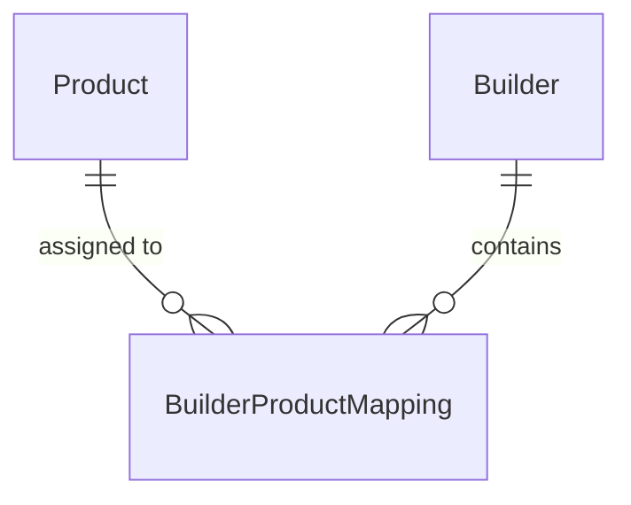

# Database Structure (PostgreSQL / Prisma schema)

The Next.js PC Builder CMS uses a Supabase PostgreSQL backend managed via Prisma. 

---

## Prisma Models

### `Product`
Stores the master data records for components.
- **`id`** (`Uuid`, Primary Key) -> Auto-generated UUID.
- **`name`** (`String`) -> Component name.
- **`category`** (`String`) -> Component category type (e.g. CPU, GPU, RAM) populated from the Category lookup.
- **`qty`** (`Int`) -> General inventory count.
- **`sdp`** (`Decimal(10,2)`) -> Standard Dealer Price.
- **`page_price`** (`Decimal(10,2)`) -> Target retail page price.
- **`srp`** (`Decimal(10,2)`) -> Suggested Retail Price.
- **`status`** (`String`) -> Deployment state (`active` / `inactive`).
- **`deletedAt`** (`DateTime`, Nullable) -> Timestamp field used for Soft Deletion support.
- **`createdAt`** / **`updatedAt`** (`DateTime`) -> Standard database timestamps.

### `Builder`
Represents build templates/packages.
- **`id`** (`Uuid`, Primary Key) -> Auto-generated UUID.
- **`name`** (`String`) -> Package template title.
- **`status`** (`String`) -> Package availability status (`active` / `inactive`).
- **`createdAt`** / **`updatedAt`** (`DateTime`) -> Standard database timestamps.

### `BuilderProductMapping`
Pivot model mapping product assignments to specific templates, acting as the spreadsheet persistence backend. 
- **`id`** (`Uuid`, Primary Key) -> Auto-generated UUID.
- **`builderId`** (`Uuid`, Foreign Key -> `Builder.id` cascade on delete)
- **`productId`** (`Uuid`, Foreign Key -> `Product.id` cascade on delete)
- **`category`** (`String`) -> Cached category name.
- **`qty`** (`Int`) -> Quantity of the product required in this builder package.
- **`sdp`** (`Decimal(10,2)`) -> Snapshot cost price.
- **`totalSdp`** (`Decimal(10,2)`) -> Calculated snapshot cost (qty * sdp).
- **`pagePrice`** (`Decimal(10,2)`) -> Snapshot target retail price.
- **`srp`** (`Decimal(10,2)`) -> Snapshot suggested retail price.
- **`margin`** (`Decimal(10,2)`) -> Calculated margin (pagePrice - totalSdp).
- **`marginPercentage`** (`Decimal(5,2)`) -> Calculated margin ratio.
- **`createdAt`** / **`updatedAt`** (`DateTime`) -> Snapshotted timestamps.

### `Category`
Stores the dynamic list of product categories.
- **`id`** (`Uuid`, Primary Key) -> Auto-generated UUID.
- **`name`** (`String`, Unique) -> Name of the category.
- **`status`** (`String`) -> Category availability status (`active` / `inactive`).
- **`createdAt`** / **`updatedAt`** (`DateTime`) -> Standard database timestamps.

---

## Model Relations

*Note: Pricing and calculated margins are snapshotted into `BuilderProductMapping` records on save, protecting historically built configuration logs from shifting if base Master Data values are updated later.*
